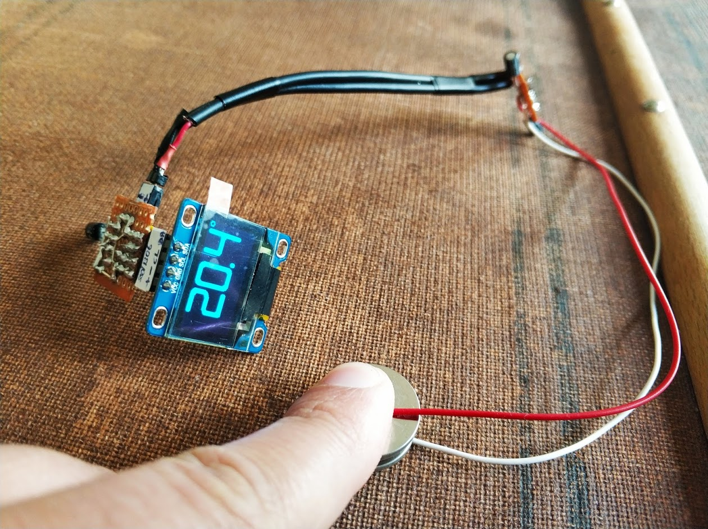
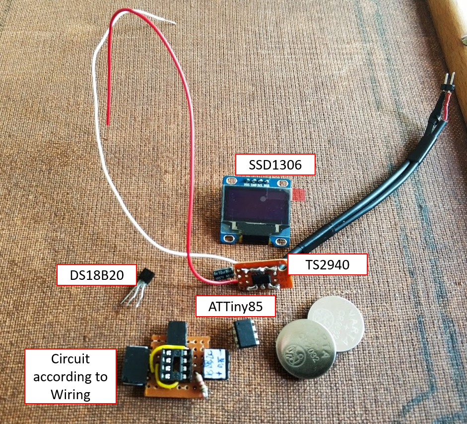
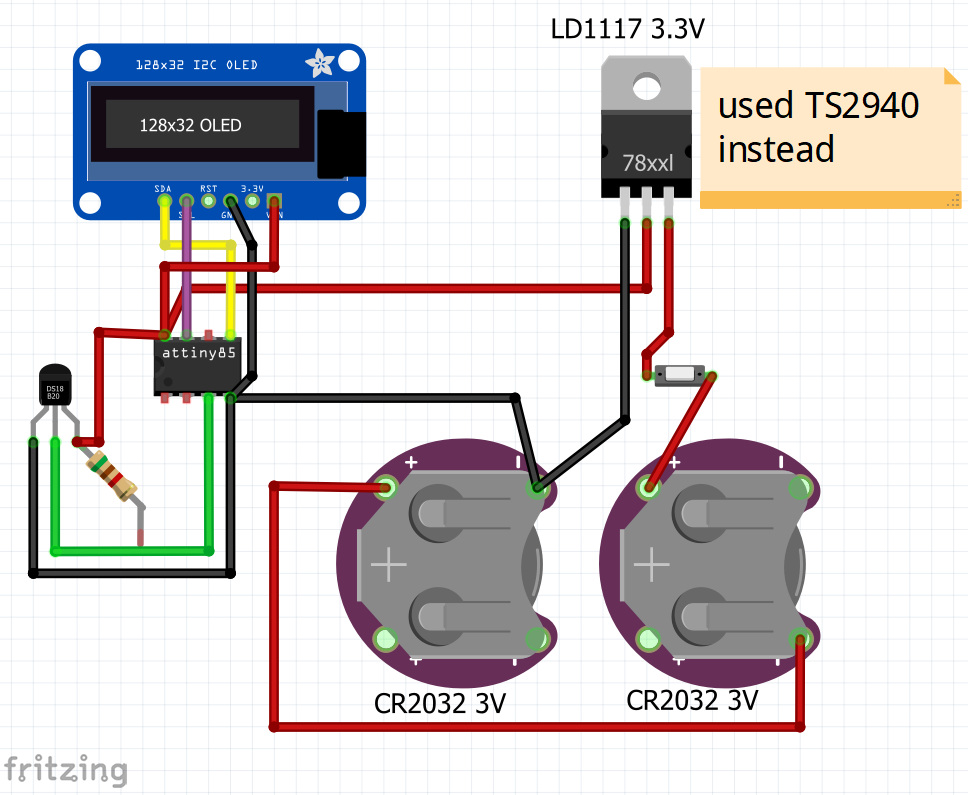

# Temperature Display: Attiny + SSD1306 + DS18B20

Showing temperature in °C on an 128x64 0.92" OLED display (ssd1306):

Parts list:
- ATTiny85
- SSD1306 OLED display
- DS18B20 Temp. Sensor
- 4.7K&Omega; resistor (for pull-up DS18B20)
- LDO like LD1117, TS2940 or similar
- 2x CR2032 batteries + battery-holder

The different parts can be plugged together. The idea is to allow the different parts to be located as needed and interconnected using wires of appropriate lengths.  

For Programming ATTiny85:
- Arduino
- further materials (breadboard,wiring,10&micro;F cap.) as in (https://www.hackster.io/arjun/programming-attiny85-with-arduino-uno-afb829)

Wiring of components:

The following sources served as input/reference/help for this project:
<ul>
    <li>https://www.adafruit.com/datasheets/SSD1306.pdf</li>
    <li>https://www.kollino.de/arduino/oled-display-mit-ssd1306-chipsatz-via-i2c-an-arduino-anschliessen/</li>
    <li>https://github.com/greiman/SSD1306Ascii/li>
    <li>https://github.com/ex-punctis/SSD1306_OLED_HW_I2C</li>
    <li>https://forum.arduino.cc/index.php?topic=560344.0</li>
    <li>https://www.arduino.cc/reference/tr/language/variables/utilities/progmem/</li>
    <li>https://www.dafont.com/de/space-age.font</li>
    <li> https://www.hackster.io/Itverkx/sleep-at-tiny-371f04</li>
    <li>https://github.com/datacute/Tiny4kOLED</li>
</ul>