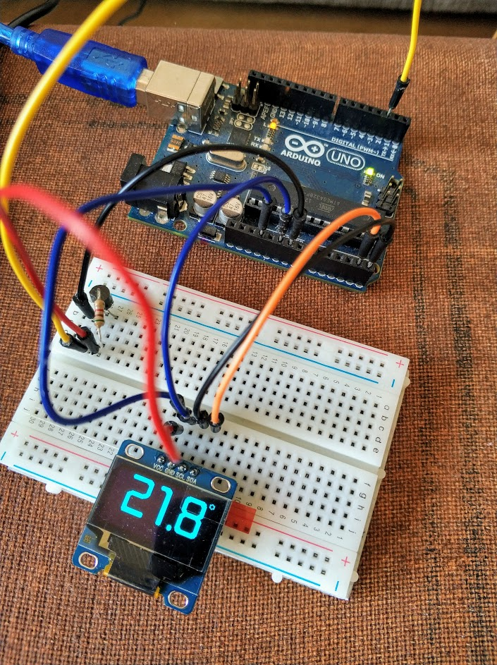
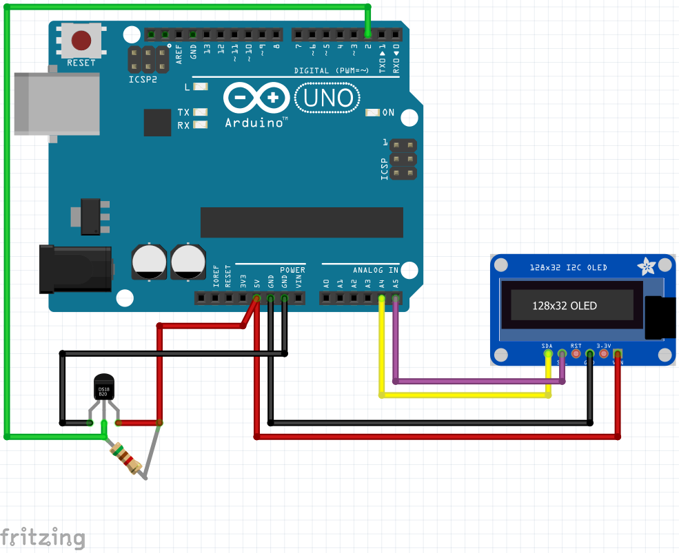

# Temperature Display: Attiny + SSD1306 + DS18B20

Showing temperature in °C on an 128x64 0.92" OLED display.

In the meantime using Arduino - will be converted to ATTiny later.

The following sources served as input for this project:
<ul>
    <li>https://www.adafruit.com/datasheets/SSD1306.pdf</li>
    <li>https://www.kollino.de/arduino/oled-display-mit-ssd1306-chipsatz-via-i2c-an-arduino-anschliessen/</li>
    <li>https://github.com/greiman/SSD1306Ascii/li>
    <li>https://github.com/ex-punctis/SSD1306_OLED_HW_I2C</li>
    <li>https://forum.arduino.cc/index.php?topic=560344.0</li>
    <li>https://www.arduino.cc/reference/tr/language/variables/utilities/progmem/</li>
    <li>https://www.dafont.com/de/space-age.font</li>
</ul>